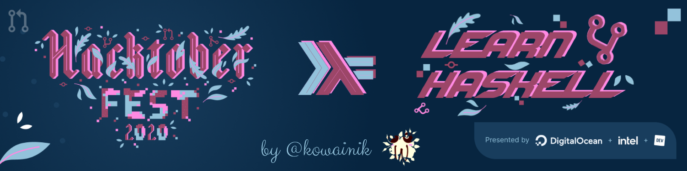

# learn4haskell



It is this time of the year when thousand pull requests are starting to float in
the air like a leaf on the wind 🍃

It is Hacktoberfest! And we are happy to be part of this fantastic event.

Usually, people are contributing to the projects within the communities they are
boiling in.
But why not to use this time learning something challenging, something fresh,
something that you never had time for?

You can get the benefits of the Hacktoberfest itself and learn wholly new but
fascinating concepts – Functional Programming with Haskell.

And we are here to help!

* 4 Pull Request to get the T-Shirt or plant a tree as stands in the Hacktoberfest rules.
* 4 Pull Request to learn to program in Haskell.
* 4 Pull Request to blow your mind.

## Table of Contents

 * [What is Learn4Haskell](#what-is-learn4haskell)
    * [Course Plan](#course-plan)
 * [Goals](#goals)
 * [Who can participate](#who-can-participate)
 * [What you will get from this course](#what-you-will-get-from-this-course)
 * [How to get started](#how-to-get-started)
    * [Installing Haskell](#installing-haskell)
    * [Haskell IDE](#haskell-ide)
    * [How to develop](#how-to-develop)
 * [Who we are](#who-we-are)
 * [How can you help](#how-can-you-help)

## What is Learn4Haskell

Learn4Haskell is a GitHub-located course that would get you into the Haskell
Functional Programming world in just 4 Pull Requests.

The course is organised as a coding project. So you would be able to complete
the course without exiting your editor.

This works in the following way. When you decide to start the project, all you
need to do is to fork the project. We prepared 4 separate modules — chapters.
Each part contains educational material and lots of examples that we provide in
the simple form that doesn't require you to know anything about FP beforehand.
Also, each chapter contains a number of exercises on everything that is
explained by us. You can solve the tasks on your way and at the end open a PR to
your fork with this chapter's solution and summon us (by shouting out our
nicknames there). We would be happy to give you feedback on your progress,
explain problematic concepts or just support you mentally!

Each chapter contains unique information and covers different topics. We suggest
you go through them in order. However, if you think that some of the chapters
are already familiar to you, feel free to skip to the next one. There is
absolutely no problem, if you would like to talk to us only on some PRs and
chapters.

Chapters are very filled with information, but yet are aimed to be doable
without additional sources. You may spend an evening per chapter, but we swear
it's worth it!

At the end of the course you should be able to independently create and read
basic Haskell code and understand Monads and other famous concepts of Functional
Programming.

### Course Plan

Here is a more concrete plan of all these mystical 4 Chapters we prepare for
you. These are the highlights of each part.

* __Chapter One__ – What is Haskell, what are its particularities, basic Haskell
  syntax, functions, types, expressions.
* __Chapter Two__ – FP concepts in the language, immutability, pattern matching,
  recursion, polymorphism, laziness, Higher-ordered functions, partial
  applications, eta-reduction.
* __Chapter Three__ – Focus on Types. Type aliases, ADTs, Product types and
  Records, Sum types and Enumerations, Newtypes, Typeclasses.
* __Chapter Four__ – Kinds. Also three monsters of the FP: Functor, Applicative,
  Monad.

## Goals

We created the Learn4Haskell project to pursue the following goals:

* Help others to learn Haskell
* Give a beginner-friendly and self-consistent course with theory and practice
  in the same place
* Explain Haskell topics before each task, but strive to be concise and useful
  at the same time. It is a tough balance!
* Help people who want to participate in Hacktoberfest and Open-Source, but also
  want to learn new things during this process
* Provide review and feedback on solutions, so people are never alone in this
  challenging journey.
* Give people who completed this course with all the necessary understanding to
  be able to work with the basic project that uses standard features. Also,
  provide a strong basis on which they should be able to continue their FP
  study.

## Who can participate

Everyone!

We welcome everyone and would be happy to assist you in this journey!

The course is intended for people who don't know Haskell or know only language
basics, though.

If you are already an experienced Haskell developer and came here for learning
advanced topics, this course might not be that for you. But you still can help!
Your feedback and suggestions would be helpful for us as well as for the
language newcomers who decide to go with this course.

## What you will get from this course

This course is coming with many benefits. Check them out to be sure that it fits
you!

So, the participation in this course would give you:

 * 4 Pull Requests required for Hacktoberfest completion
 * Basic knowledge of the most functional programming language
 * Understanding of the FP concepts that you would be able to use in your
   day-to-day life afterwards
 * On-the-fly feedback and help from experienced Haskell developers and educators
 * Interesting challenges
 * Fun!

This seems like a neat deal!

## How to get started

Starting to learn Haskell with Learn4Haskell is very easy!

1. [Fork this repository](https://docs.github.com/en/free-pro-team@latest/github/getting-started-with-github/fork-a-repo).
2. Enable GitHub Actions for your fork repository.
3. [Install the Haskell compiler](#installing-haskell).
4. Open the `src/Chapter1.hs` file, and start learning and solving tasks!
5. After you finish the first chapter (or any other chapter, or even if you are
   stuck in the middle), open
   [Pull Request](https://docs.github.com/en/free-pro-team@latest/github/collaborating-with-issues-and-pull-requests/creating-a-pull-request)
   __to your fork__ with the solution and mention @vrom911 and @chshersh and we
   would be on our way for the review.
 > Note, that you should open PR for your fork of this repo, not this repo.
 > Everyone has their own solutions to our tasks, and they don't mix together
 > well in one repo 🙂

> However, if you find some bugs or problems in this repo, you can, of course,
> open PR to Learn4Haskell directly. We appreciate any help and feedback!

Learn4Haskell has 4 chapters you can walk through and submit 4 pull requests to
complete the Hacktoberfest (or just for knowledge and fun sake).

So, you can start right now with forking. And we will describe how you can
install all necessary to be able to run this course locally in the following
section.

### Installing Haskell

If you on Linux or macOS, then the process is easy:

1. Install [ghcup](https://www.haskell.org/ghcup/) and follow `ghcup`
   instructions for successful installation.
2. Install the latest version of the Haskell compiler — GHC — and the
   [Cabal](https://www.haskell.org/cabal/) build tool. After you install
   `ghcup`, it is easy to install the rest with a few commands from your
   terminal

    ```shell
    ghcup install ghc 8.10.2
    ghcup set ghc 8.10.2
    ghcup install cabal 3.2.0.0
    ```
3. Run `cabal update` to fetch the latest info about Haskell packages.

### Haskell IDE

If you don't have any IDE preferences, we recommend installing
[Visual Studio Code](https://code.visualstudio.com/download) with the
[Haskell plugin](https://marketplace.visualstudio.com/items?itemName=haskell.haskell).
The mentioned plugin would give you all the necessary to immediately start coding with Haskell.

### How to develop

The course assumes that you install Haskell tooling (GHC and Cabal), edit code
in the corresponding chapters, run GHCi (Haskell interpreter, explained in the
course) from the root of this project and load your chapters to check your code.
Don't worry, each Chapter explains all relevant information!

We also provide Makefile with commands to test your solutions locally with our
prepared test-suite locally. At the same time, we configured CI using GitHub
Actions for Learn4Haskell to check your answers at GitHub right away!

To run all tests for Chapter One:

```shell
make test-chapter1
```

To run tests only for basic tasks for Chapter One (without the advanced tasks):

```shell
make test-chapter1-basic
```

Similar commands are provided for all chapters from One to Four.

## Who we are

[Veronika (@vrom911)](https://vrom911.github.com/) and
[Dmitrii (@chshersh)](https://kodimensional.dev/) are experienced Haskell developers.
Together we drive this open source organisation —
[Kowainik](https://kowainik.github.io/). We have a lot of open source projects
and libraries in Haskell that are used in the Haskell community. We are also
working on a lot of tutorials and guides in Haskell and mentoring people who are
keen to learn Haskell as well. Moreover, Dmitrii has a few years of experience
teaching Haskell courses in the university for the CS students.

We are passionate about Functional Programming and Haskell in particular. But at
the same time we understand how difficult it could be to get into all these
ideas on your own. That is why we decided to start this course to help
newcomers. With the interactive learning process and live discussions, Haskell
could be not that scary, at least we will do our best that it won't be the case
for you!

## How can you help

You can help us by supporting us on Ko-Fi or via GitHub sponsorship program:

* [Kowainik Ko-Fi](https://ko-fi.com/kowainik)
* [Veronika Romashkina via GitHub](https://github.com/sponsors/vrom911)
* [Dmitrii Kovanikov via GitHub](https://github.com/sponsors/chshersh)


We also appreciate any feedback on our course a lot! You can submit your
feedback using the following form:
* https://docs.google.com/forms/d/e/1FAIpQLScBVhLxq5CgGnAfIGUE-fCoOUqeGkDY2HXzbT7KV2jjLOsmjQ/viewform
